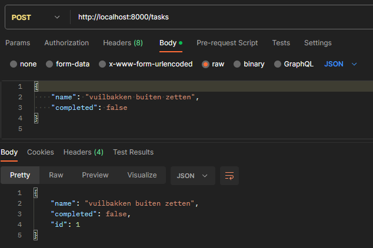
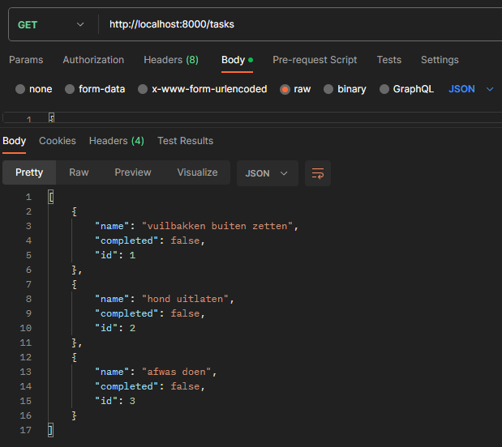
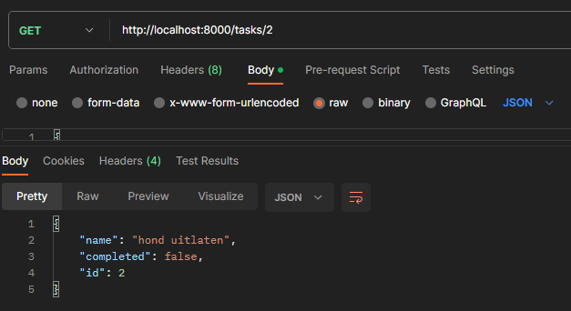
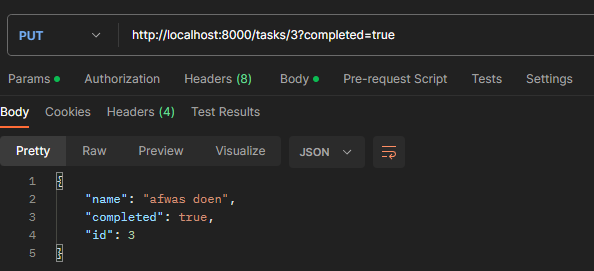
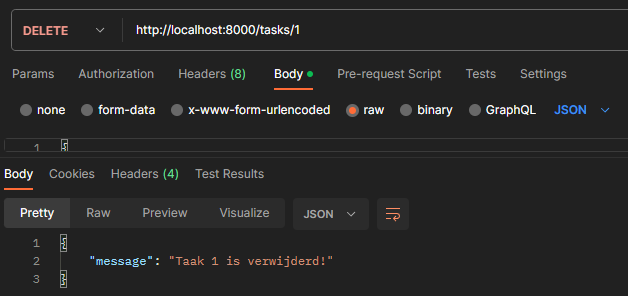
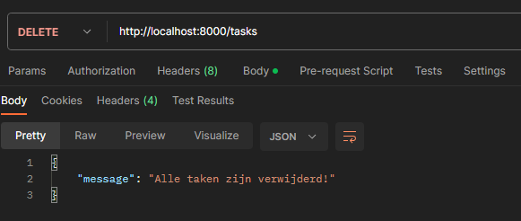

# Project API Development
## Arne Madalijns - r0937871
### Gekozen thema
Ik heb gekozen om een takenlijst te maken, dit omdat de GET en DELETE requests hier makkelijk op toe te voegen waren.

### Uitleg over mijn API
Deze API biedt een interface voor het beheren van een takenlijst. Met de API kunnen gebruikers taken toevoegen, verwijderen, bijwerken en weergeven, samen met de mogelijkheid om de voltooiingsstatus van elke taak te markeren. De API maakt gebruik van FastAPI, waardoor het mogelijk is om snel en efficiënt endpoints te definiëren voor het uitvoeren van CRUD-operaties op de takenlijst.

Met behulp van Pydantic-modellen zorgt de API voor de juiste validatie van gegevens. Bovendien maakt de integratie van een SQLite-database het mogelijk om de takenlijst persistent op te slaan en te beheren. De API maakt gebruik van de REST-architectuurstijl, waardoor gebruikers gemakkelijk toegang hebben tot de endpoints met behulp van standaard HTTP-methoden zoals GET, POST en DELETE.

### Link naar hosted API
hier komt de link

### Aantoonbare werking

Nieuwe taak aanmaken: 

Alle taken tonen: 

Een specifieke taak tonen: 

Een specifieke taak updaten: 

Een specifieke taak verwijderen: 

Alle taken verwijderen: 

